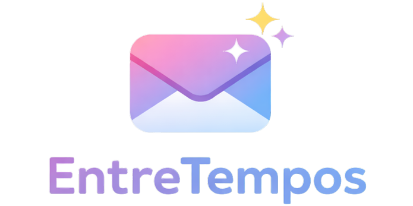

<p align="center">
  
</p>

<p align="center">
  <b>Uma cápsula do tempo digital para conversar com o seu eu do futuro.</b>
</p>

<p align="center">
  


</p>

---

## 💡 Ideia

Já pensou em escrever algo hoje… e só poder ler no futuro?

O **EntreTempos** transforma essa ideia em uma experiência real:

* você escreve uma carta agora ✍️
* define uma data no futuro ⏳
* e só poderá acessar quando esse momento chegar 🔓

> Mais do que um app, é uma experiência emocional que conecta passado, presente e futuro.

---

## ✨ Experiência

O foco do app não é apenas funcional — é **sentimento**:

* 💌 Expectativa ao aguardar a abertura
* 🔒 Curiosidade com cartas bloqueadas
* ✉️ Animação imersiva ao abrir (efeito envelope)
* 💭 Reflexão ao revisitar pensamentos antigos

---

## 🎥 Preview

---

## 🚀 Funcionalidades

### ✍️ Criar cartas

* Título
* Conteúdo livre
* Data de abertura

---

### 📎 Anexos

* 📷 Até 5 imagens por carta
* 🎤 Áudio (até 1MB)

---

### 📬 Organização

* 🔒 Cartas bloqueadas
* 🔓 Cartas liberadas

---

### 📄 Exportar carta

* 💾 Exportação em PDF com um clique
* 🖼️ Inclui imagens e conteúdo

---

### ✉️ Abertura da carta

* Animação de envelope
* Responder carta (linha do tempo pessoal)

---

### 👤 Perfil

* Nome e email
* Edição de dados
* Recuperação de senha

---

### 🌙 UX

* Tema escuro
* Interface responsiva

---

## 🛠️ Tecnologias

O projeto foi construído com foco em **performance, escalabilidade e experiência do usuário**.

### 🚀 Stack principal

* **Flutter 3.22+**
* **Dart 3.10**

---

### 🔐 Backend & Dados

* **Firebase Authentication** → gerenciamento de usuários (login, cadastro, recuperação de senha)
* **Cloud Firestore** → armazenamento das cartas e dados do usuário em tempo real

---

### 📎 Manipulação de arquivos

* **Image Picker / File Picker** → seleção de imagens e arquivos
* **AudioPlayers** → reprodução de áudios

#### 💡 Estratégia adotada:

* Imagens armazenadas inicialmente em **Base64** (MVP simplificado)
* Estrutura preparada para migração futura para **Firebase Storage**
* Limite de **1MB para áudio** para manter performance e baixo custo

---

## 📦 Instalação

```bash
# Clone o repositório
git clone https://github.com/maiarakothe/entre_tempos.git

# Acesse a pasta
cd entre_tempos

# Instale as dependências
flutter pub get

# Execute o projeto
flutter run
```

---

## 👩‍💻 Autora

<p align="center">
  Desenvolvido por <b>Maiara Kothe 💜</b><br><br>
  <a href="https://www.linkedin.com/in/maiara-kothe/" target="_blank">
    
  </a>
  <a href="mailto:maiarabraunkothe@hotmail.com">
    
  </a>
</p>


